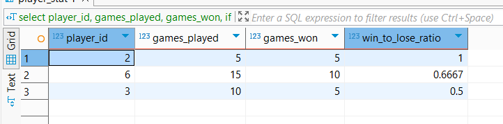
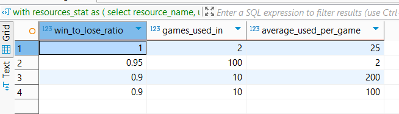
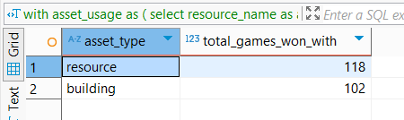
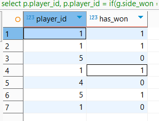
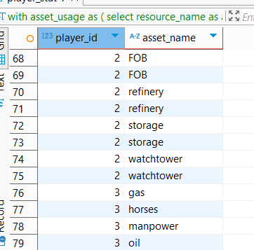

# itd-assignment-1

Code description is in comments.

Business logic behind this database involves optimizing and balancing a competitive multiplayer game.

Key features include:
players, games and "assets" (those are units, building and resources)

Players and assets score wins or loses based on game result.
win_to_lose_ration is often computed to determine whether the value is good or bad.

Assets can be balanced based on they win_to_lose_ratio to provide a better gameplay.

Here are previews of queries results:

